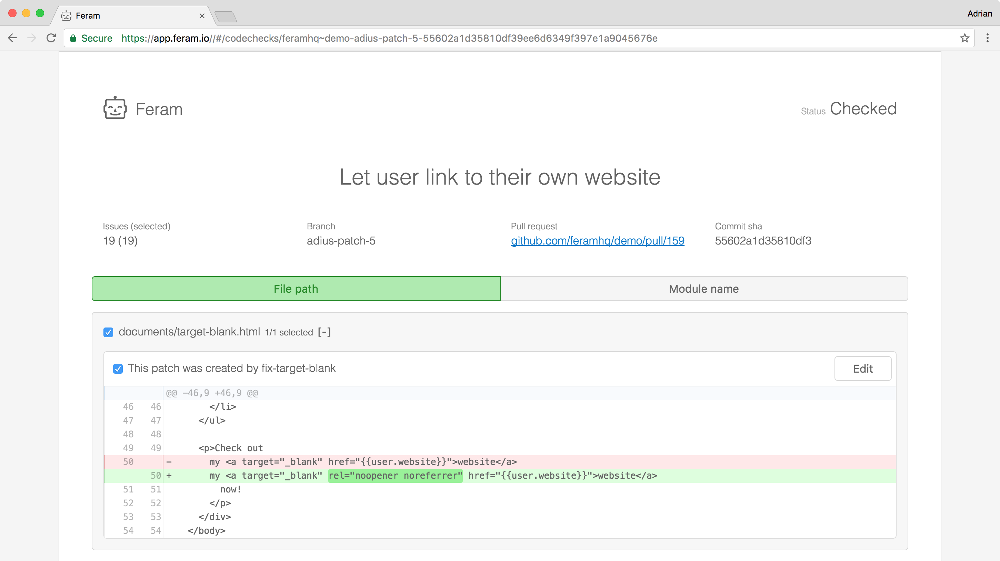

# FastLint

FastLint automatically finds bugs in your code
with a cutting-edge AI-powered code analysis tool.

This repository is currently used as a public issue tracker for FastLint.

Learn more about us on following websites:

- [Official Website]
- [Twitter]

[Official Website]: https://fastlint.com
[Twitter]: https://twitter.com/feramhq
